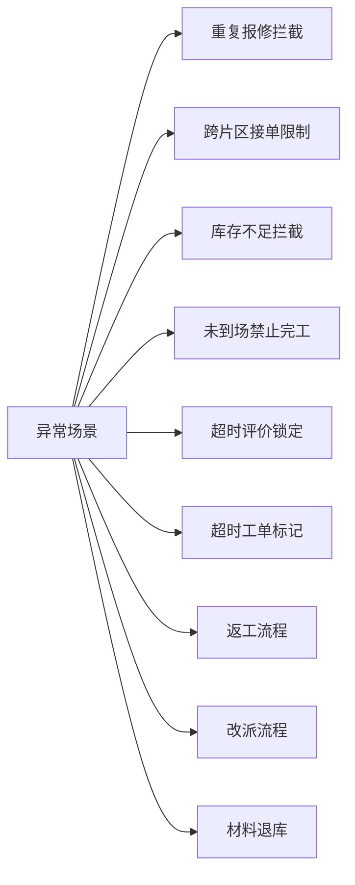

## 1. 产品概述
物业维修派单与材料核销系统，面向小区物业场景，实现从住户报修到工单关闭的全流程管理，包含派单、维修处理、材料核销、服务评价及数据导出功能。
- 目标用户：住户、客服、维修工、物业管理员
- 核心价值：规范维修流程、精准材料核销、提升服务质量、保障数据可追溯

## 2. 核心功能

### 2.1 用户角色
| 角色 | 说明 | 核心权限 |
|------|------|----------|
| 住户 | 小区业主/租户 | 提交报修、查看工单、评价服务 |
| 客服 | 物业客服人员 | 受理报修、派单、改派、查看全部工单 |
| 维修工 | 维修人员 | 接单、到场、处理、完工、记录材料 |
| 管理员 | 物业管理人员 | 看板查看、库存管理、评价管理、数据导出 |

### 2.2 功能模块
1. **住户端**：报修提交、工单列表、工单详情、服务评价
2. **客服端**：工单受理、智能派单、改派、工单看板
3. **维修端**：工单列表、到场签到、处理记录、材料使用、完工提交
4. **管理端**：维修看板、材料库存、服务评价、数据导出

### 2.3 页面详情
| 页面名称 | 模块名称 | 功能描述 |
|-----------|-------------|---------------------|
| 登录/角色选择 | 角色切换 | 选择住户/客服/维修工/管理员角色登录 |
| 住户-报修页 | 报修表单 | 填写楼栋、单元、房间、类型、紧急程度、问题描述、上传图片 |
| 住户-工单列表 | 工单卡片 | 展示个人工单列表及状态 |
| 住户-工单详情 | 流转记录 | 展示工单完整流转、处理过程、材料使用、评价入口 |
| 客服-工单受理 | 待受理列表 | 展示待受理工单，支持按楼栋/类型筛选 |
| 客服-派单页面 | 派单表单 | 选择维修工(按片区/技能/负载)、派单备注 |
| 客服-工单看板 | 状态看板 | 各状态工单数量统计、超时标记、异常工单 |
| 维修-我的工单 | 工单列表 | 展示分配给我的工单，支持接单 |
| 维修-处理页面 | 处理流程 | 到场签到、处理说明、材料选择、完工照片上传 |
| 管理-维修看板 | 数据看板 | 工单总量、处理时长、各楼栋/类型统计 |
| 管理-材料库存 | 库存管理 | 材料列表、库存数量、出入库流水、低库存预警 |
| 管理-评价管理 | 评价列表 | 全部评价、评分统计、异常评价标记 |
| 管理-数据导出 | 导出中心 | 按条件导出、查看导出历史、下载 |

## 3. 核心流程

### 3.1 工单主流程

### 3.2 材料核销流程

### 3.3 异常处理流程

## 4. 业务约束规则

### 4.1 重复报修限制
- 同一住户、同一房间、同类型且未关闭的工单存在时，禁止提交新报修

### 4.2 跨片区接单限制
- 每个维修工绑定负责片区(楼栋范围)
- 派单时仅显示负责该片区的维修工
- 维修工仅能接收片区内工单

### 4.3 材料库存控制
- 维修工使用材料前实时校验库存
- 库存不足时提交失败并提示
- 完工后材料扣减不可撤销(退库除外)

### 4.4 到场签到约束
- 必须先"到场签到"才能进行处理
- 未签到直接点完工，系统拦截并提示

### 4.5 评价时间窗口
- 完工后7天内可评价
- 超7天未评价自动关闭，锁定评价入口
- 评价提交后不可修改

### 4.6 超时工单标记
- 已派单超过24小时未到场 → 标记黄色预警
- 处理中超过48小时未完工 → 标记红色超时
- 看板突出显示超时工单

## 5. 用户界面设计

### 5.1 设计风格
- **主色调**：深蓝色(#1e3a5f)专业稳重，辅助色青绿色(#0d9488)代表服务
- **警示色**：黄色(#f59e0b)预警、红色(#ef4444)异常、绿色(#10b981)正常
- **按钮风格**：圆角8px，悬停阴影，点击反馈
- **字体**：中文优先使用系统默认，标题加粗，正文常规
- **布局**：顶部导航+侧边栏+主内容区，卡片式布局
- **图标**：使用 lucide-react 图标库

### 5.2 页面设计
| 页面名称 | UI元素 | 设计要点 |
|-----------|-------------|-------------|
| 登录/角色选择 | 角色卡片大按钮 | 卡片悬浮动效，点击高亮选中 |
| 报修表单 | 分区表单、分步指引 | 楼栋联动选择，紧急程度用颜色区分 |
| 工单看板 | 状态列卡片拖拽区域 | 各状态用不同色边，超时卡片红色闪烁 |
| 维修处理页 | 步骤条、材料选择器 | 到场/处理/完工步骤进度，材料数量加减器 |
| 数据看板 | 图表卡片、统计数字 | 大数字统计+趋势，图表区用渐变填充 |

### 5.3 响应式
- 桌面端优先设计(>1024px)
- 平板端(768-1024px)：侧边栏折叠为图标
- 移动端(<768px)：顶部导航折叠，列表简化展示
