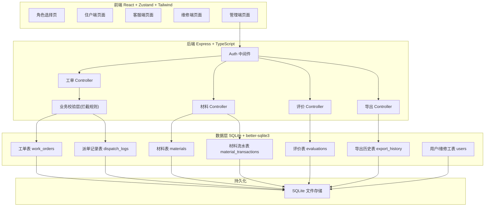
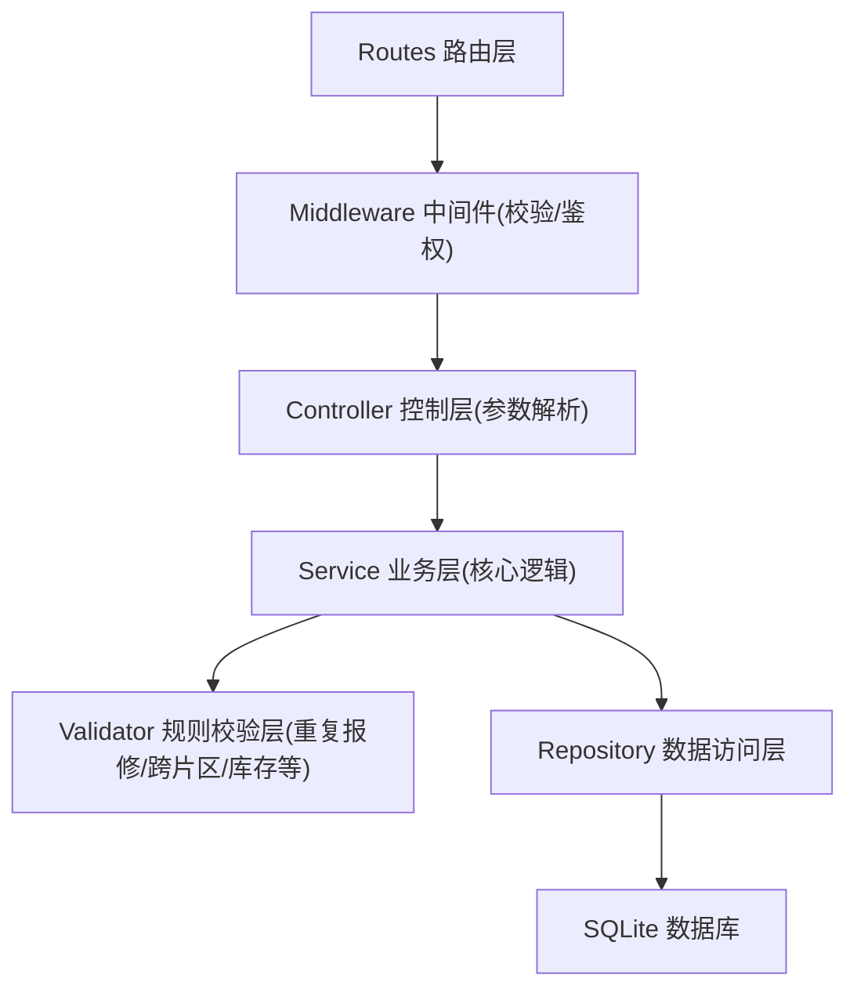
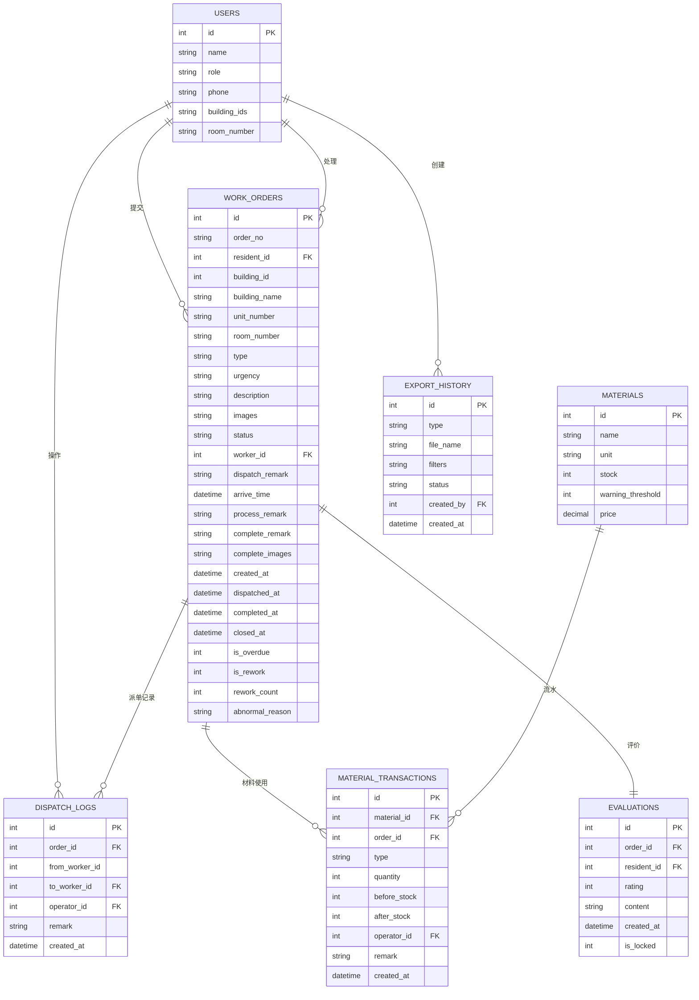

## 1. 架构设计


## 2. 技术说明
- **前端**：React@18 + TypeScript + Vite + tailwindcss@3 + zustand + react-router-dom + lucide-react + recharts
- **后端**：Express@4 + TypeScript + better-sqlite3
- **数据库**：SQLite(文件持久化，重启不丢失)
- **初始化工具**：vite-init (react-express-ts 模板)

## 3. 路由定义

### 3.1 前端路由
| 路由 | 用途 |
|-------|---------|
| / | 角色选择/登录页 |
| /resident/report | 住户提交报修 |
| /resident/orders | 住户工单列表 |
| /resident/orders/:id | 住户工单详情+评价 |
| /service/orders | 客服工单看板/受理 |
| /service/orders/:id/dispatch | 客服派单/改派 |
| /worker/orders | 维修工我的工单 |
| /worker/orders/:id/process | 维修工处理页面 |
| /admin/dashboard | 管理-维修看板 |
| /admin/materials | 管理-材料库存 |
| /admin/evaluations | 管理-服务评价 |
| /admin/export | 管理-数据导出 |

### 3.2 后端 API 路由
| Method | Route | 用途 |
|--------|-------|------|
| POST | /api/auth/login | 模拟登录(选择角色获取用户信息) |
| GET | /api/users | 获取用户列表(维修工/客服等) |
| POST | /api/work-orders | 提交报修 |
| GET | /api/work-orders | 获取工单列表(支持筛选) |
| GET | /api/work-orders/:id | 获取工单详情 |
| PUT | /api/work-orders/:id/accept | 受理工单 |
| POST | /api/work-orders/:id/dispatch | 派单/改派 |
| PUT | /api/work-orders/:id/arrive | 维修工到场签到 |
| PUT | /api/work-orders/:id/process | 处理中更新 |
| POST | /api/work-orders/:id/complete | 完工提交(含材料使用) |
| PUT | /api/work-orders/:id/rework | 返工处理 |
| POST | /api/work-orders/:id/evaluate | 住户评价 |
| GET | /api/materials | 获取材料列表 |
| POST | /api/materials | 新增材料 |
| PUT | /api/materials/:id | 更新材料信息 |
| POST | /api/materials/:id/stock-in | 材料入库 |
| POST | /api/materials/:id/return | 材料退库 |
| GET | /api/material-transactions | 获取材料流水 |
| GET | /api/evaluations | 获取评价列表 |
| GET | /api/admin/stats | 获取看板统计数据 |
| POST | /api/admin/export | 创建导出任务 |
| GET | /api/admin/export/:id/download | 下载导出文件 |
| GET | /api/admin/export-history | 获取导出历史 |

## 4. API 类型定义

```typescript
// 工单状态
type WorkOrderStatus = 'pending' | 'dispatched' | 'processing' | 'pending_evaluation' | 'closed';

// 紧急程度
type UrgencyLevel = 'low' | 'medium' | 'high' | 'urgent';

// 报修类型
type RepairType = 'plumbing' | 'electrical' | 'structural' | 'appliance' | 'other';

interface User {
  id: number;
  name: string;
  role: 'resident' | 'service' | 'worker' | 'admin';
  phone?: string;
  buildingIds?: number[]; // 维修工负责楼栋
  roomNumber?: string;
}

interface WorkOrder {
  id: number;
  orderNo: string;
  residentId: number;
  residentName: string;
  buildingId: number;
  buildingName: string;
  unitNumber: string;
  roomNumber: string;
  type: RepairType;
  urgency: UrgencyLevel;
  description: string;
  images: string[];
  status: WorkOrderStatus;
  workerId?: number;
  workerName?: string;
  dispatchRemark?: string;
  arriveTime?: string;
  processRemark?: string;
  completeRemark?: string;
  completeImages: string[];
  createdAt: string;
  dispatchedAt?: string;
  completedAt?: string;
  closedAt?: string;
  isOverdue: boolean;
  isRework: boolean;
  reworkCount: number;
  abnormalReason?: string;
}

interface DispatchLog {
  id: number;
  orderId: number;
  fromWorkerId?: number;
  toWorkerId: number;
  operatorId: number;
  remark: string;
  createdAt: string;
}

interface Material {
  id: number;
  name: string;
  unit: string;
  stock: number;
  warningThreshold: number;
  price: number;
}

interface MaterialTransaction {
  id: number;
  materialId: number;
  materialName: string;
  orderId?: number;
  type: 'use' | 'stock_in' | 'return' | 'adjust';
  quantity: number;
  beforeStock: number;
  afterStock: number;
  operatorId: number;
  remark: string;
  createdAt: string;
}

interface Evaluation {
  id: number;
  orderId: number;
  residentId: number;
  rating: number; // 1-5
  content: string;
  createdAt: string;
  isLocked: boolean; // 超时锁定
}

interface ExportRecord {
  id: number;
  type: 'quality' | 'material' | 'evaluation';
  fileName: string;
  filters: Record<string, any>;
  status: 'processing' | 'done';
  createdBy: number;
  createdAt: string;
}
```

## 5. 服务端架构


## 6. 数据模型

### 6.1 ER 图


### 6.2 初始化数据
- 预置4个角色用户：住户张三、客服李四、维修工王师傅(负责1-2号楼)、维修工赵师傅(负责3-5号楼)、管理员系统管理员
- 预置材料：水管、水龙头、灯泡、电线、开关、门锁
- 预置几栋楼栋数据：1号楼、2号楼、3号楼、4号楼、5号楼
